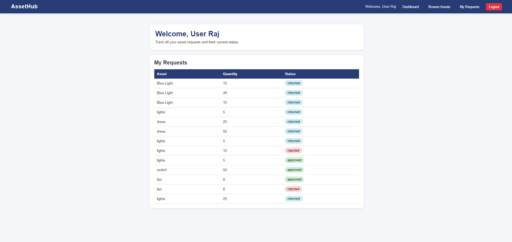
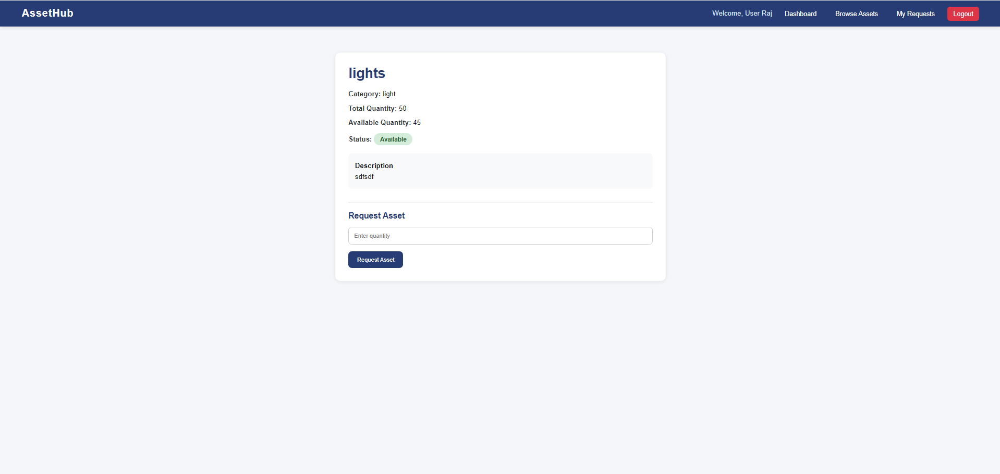
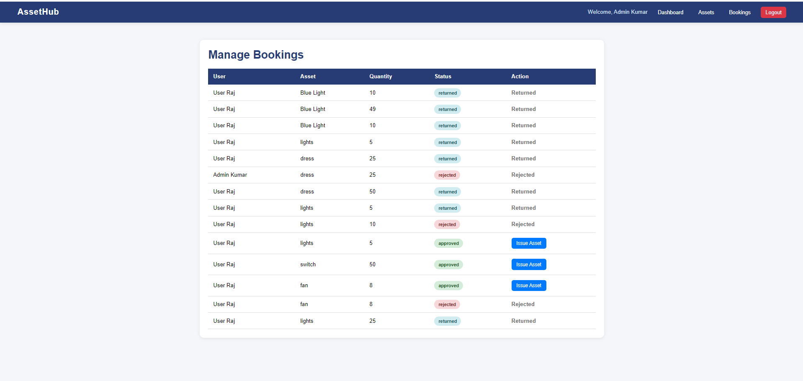
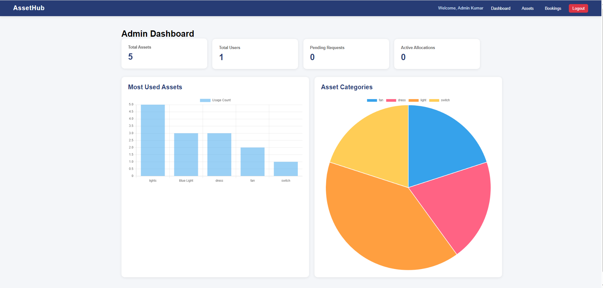

# Smart Asset Management and Resource Allocation Platform


A full-stack asset management platform that enables organizations to efficiently track inventory, manage resource allocation, handle booking approvals, and monitor asset utilization through an intuitive dashboard.

---

## Table of Contents

* [Overview](#overview)
* [Highlights](#highlights)
* [Features](#features)
* [Tech Stack](#tech-stack)
* [System Architecture](#system-architecture)
* [Project Structure](#project-structure)
* [Installation](#installation)
* [Environment Variables](#environment-variables)
* [User Roles](#user-roles)
* [Workflow](#workflow)
* [Key Functionalities](#key-functionalities)
* [Dashboard Analytics](#dashboard-analytics)
* [Screenshots](#screenshots)
* [Future Enhancements](#future-enhancements)
* [Author](#author)

---

## Overview

Organizations often struggle with managing shared resources due to fragmented communication, manual records, and limited inventory visibility. This platform addresses these challenges by providing a centralized asset management system that enables users to discover, request, borrow, and return assets efficiently.

The system supports role-based workflows for administrators and users while maintaining accurate inventory records throughout the asset lifecycle.

---

## Highlights

- Role-based access control (Admin/User)
- Session-based authentication
- Asset booking and approval workflow
- Real-time inventory tracking
- Asset issue and return management
- Interactive analytics dashboard
- Borrowing history tracking

---

## Features

### Secure Authentication

* Session-based authentication
* User registration and login
* Role-based authorization
* Protected routes and secure sessions

### Inventory Management

* Add, edit, and delete assets
* Categorize assets
* Track available quantities
* Update asset status

### Asset Discovery

* Browse all available assets
* Search and filter inventory
* View real-time availability
* Prevent overbooking based on inventory count

### Booking & Approval Workflow

* Submit asset booking requests
* Track request status
* Admin approval and rejection system
* Active allocation monitoring

### Asset Issue & Return Management

* Issue approved assets
* Return request handling
* Due-date tracking
* Automatic inventory updates

### Borrowing History

* View current allocations
* Track previous bookings
* Access complete borrowing history

### Analytics Dashboard

* Asset utilization statistics
* Most frequently used assets
* Active bookings overview
* Available inventory monitoring
* Overdue asset tracking
* Interactive charts and visualizations

---

## Tech Stack

### Frontend

* HTML5
* CSS3
* JavaScript
* EJS Templates

### Backend

* Node.js
* Express.js

### Database

* MongoDB
* Mongoose

### Authentication

* Express Session

### Data Visualization

* Chart.js

### Development Tools

* Git
* GitHub

---

## System Architecture

```text
User/Admin
     │
     ▼
Frontend (EJS + CSS + JavaScript)
     │
     ▼
Express.js Backend
     │
 ┌───┼───────────────┐
 │   │               │
 ▼   ▼               ▼
Authentication   Asset Management
                     │
                     ▼
             Booking & Approval
                     │
                     ▼
             Issue / Return Flow
                     │
                     ▼
                Analytics
                     │
                     ▼
               MongoDB Database
```

---

## Project Structure

```bash
project-root/
│
├── config/
├── controllers/
├── middleware/
├── models/
├── routes/
├── screenshots/
├── services/
├── utils/
│
├── views/
│   ├── admin/
│   ├── asset/
│   ├── auth/
│   ├── partials/
│   └── user/
│
│
├── app.js
├── package.json
├── .env
└── README.md
```

---

## Installation

### Clone Repository

```bash
git clone https://github.com/anime024/Smart-Asset-Management-and-Resource-Allocation-Platform-.git
cd Smart-Asset-Management-and-Resource-Allocation-Platform-
```

### Install Dependencies

```bash
npm install
```

### Create Environment File

Create a `.env` file in the root directory.

```env
PORT=3000

MONGO_URI=your_mongodb_connection_string

SESSION_SECRET=your_secret_key
```

### Run the Application

```bash
npm start
```

or

```bash
nodemon app.js
```

---

## Environment Variables

| Variable       | Description                       |
| -------------- | --------------------------------- |
| PORT           | Application Port                  |
| MONGO_URI      | MongoDB Connection String         |
| SESSION_SECRET | Secret key for session management |

---

## User Roles

### Administrator

* Manage assets and inventory
* Approve or reject booking requests
* Issue and receive returned assets
* Monitor inventory availability
* View system-wide analytics

### User

* Browse available assets
* Search and filter inventory
* Request asset bookings
* Track booking status
* View borrowing history
* Return allocated assets

---

## Workflow

```text
Admin Adds Assets
        │
        ▼
 User Browses Inventory
        │
        ▼
 Submits Booking Request
        │
        ▼
 Admin Reviews Request
        │
 ┌──────┴──────┐
 │             │
Approve      Reject
 │
 ▼
Asset Issued
 │
 ▼
User Returns Asset
 │
 ▼
Inventory Updated
```

---

## Key Functionalities

### Inventory Management

* Centralized asset repository
* Real-time stock tracking
* Asset categorization

### Booking System

* Availability checking
* Duration-based requests
* Request status tracking

### Approval Management

* Request review dashboard
* Approval/rejection workflow
* Active allocation tracking

### Return Management

* Due-date monitoring
* Return processing
* Inventory synchronization

### History Tracking

* User borrowing records
* Asset allocation history
* Administrative audit trail

---

## Dashboard Analytics

The platform provides visual insights through:

* Summary Cards

  * Total Assets
  * Available Assets
  * Active Bookings

* Charts

  * Asset Utilization Rate
  * Most Frequently Used Assets
  * Inventory Distribution

These analytics help administrators make informed resource allocation decisions.

---

## Screenshots

### User Dashboard


### Booking Request 


### Admin Booking Management


### Analytics Dashboard



---

## Future Enhancements

* Email notifications for approvals and due dates
* QR code-based asset tracking
* Barcode integration
* Asset maintenance scheduling
* Multi-organization support
* Export reports in PDF/Excel format
* Real-time notifications using WebSockets

---

## Author

**Animesh Raj**

Electrical Engineering, IIT Roorkee

---

